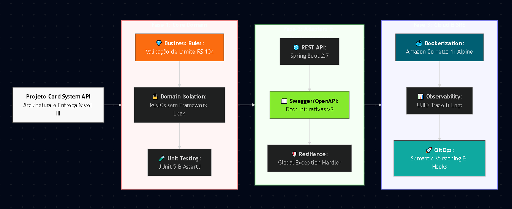

<!-- 
  Tags: DevOps,DevOps,Iac , Dev , Dev, Dev, Dev ,IoT ,DadosIA
  Label: 💳 Card System Platform - Santander/F1RST Evolution
  Description:⭐ Microserviço focado no processamento de transações de cartões
  technical_requirement: Java 11, Spring Boot 2.7, Spring Data JPA, Hibernate, MySQL, Docker, Maven, JUnit 5, Hexagonal Architecture, SOLID, Clean Architecture, REST API, Global Exception Handling, Bean Validation, Bash Scripting, Linux (Debian), Git, GitFlow, Amazon Corretto, Multi-stage builds, CI/CD, GitHub Actions, SRE, Troubleshooting, Cloud Computing.
  path_hook: hookfigma.hook18,hookfigma.hook6,hookfigma.hook20,hookfigma.hook7,hookfigma.hook8,hookfigma.hook11, hookfigma.hook16,hookfigma.hook4,hookfigma.hook2
-->
# 💳 Card System Platform - Santander/F1RST Evolution (Full Cycle)



Este projeto é um Microserviço focado no processamento de transações de cartões, desenvolvido como forma que encontrei de apresentar minhas hardskills no processo seletivo para a posição de **Analista de Sistemas III**.

## 📖 Storytelling: A Jornada da Resiliência
Imagine uma **Black Friday** no ecossistema **Santander**. Milhares de transações por segundo cruzam a rede. Neste cenário, uma falha não é apenas um erro de log; é um cliente impossibilitado de comprar. 

Este projeto nasceu para transcender o desenvolvimento tradicional. 
## **♾️ Abordagem SRE-Driven:**
Este projeto consiste em um microserviço robusto para a autorização e processamento de transações de cartões, desenvolvido com o objetivo de demonstrar competências avançadas em arquitetura de software, resiliência de sistemas e boas práticas de desenvolvimento para a posição de Analista de Sistemas III.

---

## 🌟 Specialist Evolution (Vaga Atual: Especialista AIOps)
Diferente da versão inicial de Analista III, esta branch introduz conceitos avançados de **SRE** e **AIOps**, elevando a maturidade do microserviço:

- **Observabilidade Full-Stack**: Implementação de métricas customizadas via **Micrometer** e exposição de telemetria via **Spring Actuator**.
- **Python AIOps Agent**: Script lateral (`/scripts`) que consome dados de saúde da API para automação de incidentes.
- **FinOps Ready**: Configuração de limites de recursos (CPU/MEM) no CI/CD para otimização de custos no GCP Cloud Run.
- **Resiliência Nativa**: Implementação de *Liveness* e *Readiness Probes* para garantir o Self-healing do container.
- **Analytics Integrado**: Camada de dados pronta para BI (Looker) para visão executiva do negócio.
 
## 🚀 Tecnologias e Frameworks
- **Java 11**: Linguagem base para conformidade com o ecossistema atual.
- **Spring Boot 2.7**: Framework para agilidade no desenvolvimento de microserviços.
- **Arquitetura Hexagonal (Ports and Adapters)**: Para garantir desacoplamento total da regra de negócio.
- **JUnit 5**: Para testes unitários de regras críticas.
- **Docker**: Containerização com imagem **Amazon Corretto 11** para ambiente Cloud-Ready.
- **Maven**: Gerenciamento de dependências e build.
- **Cloud Friendly**: Containerização otimizada com Amazon Corretto para deploy imediato em ambientes AWS, Azure ou Kubernetes.
- **OpenAPI/Swagger**: Documentação interativa integrada para facilitar o consumo por times de Frontend e Integração.
- **GitHub Actions**: Esteira de CI/CD totalmente automatizada.
- **Google Cloud Platform (GCP)**: Infraestrutura de hospedagem via Cloud Run (Serverless). 
- **Prometheus & Grafana**: Dashboards técnicos de saúde do sistema (SRE).
- **Kubernetes (Minikube)**: Orquestração local com suporte a HPA e Metrics Server.
- **Terraform**: Infraestrutura como Código para GCP e Docker local.
- **Looker / LookML**: Modelagem de dados para análise de KPIs.

## 🏗️ Arquitetura
O projeto utiliza **Arquitetura Hexagonal** para isolar o domínio das tecnologias externas (bancos de dados, frameworks, APIs externas). A plataforma utiliza o padrão de Persistência Poliglota Decoupled. Enquanto o PostgreSQL garante a consistência transacional (ACID), o MongoDB atua como um 'Side-Persistence' para logs de auditoria não estruturados, e o MySQL funciona como uma réplica de leitura para BI. Essa segregação impede que o tráfego de analytics degrade a performance do motor de autorização financeiro.

- **Domain**: Entidades e regras de negócio puras.
- **Application**: Casos de uso e portas de entrada/saída.
- **Adapters (In/Out)**: Implementações técnicas (REST Controllers, Persistence, etc.).

## 🛡️ Diferenciais Implementados
- **Global Exception Handler**: Padronização de erros JSON para conformidade com gateways de API.
- **Troubleshooting Ready**: Logs estruturados para facilitar a análise em ambientes produtivos.
- **Cloud Friendly**: Configuração preparada para ambientes AWS/Azure via Docker.

---

## 🏗️ Arquitetura e CI/CD
O projeto segue os princípios de **Clean Architecture** e utiliza uma esteira automatizada para deploy. 

### Pipeline de Entrega Continua:
1. **Build**: Compilação via Maven no GitHub Runner.
2. **Containerize**: Criação da imagem Docker e push para o **GCP Artifact Registry**.
3. **Deploy**: Atualização automática do serviço no **GCP Cloud Run**.

---

## 🎭 Camada de Frontend Multi-Framework

O ecossistema foi projetado para ser agnóstico à tecnologia de interface, utilizando **Arquitetura Hexagonal** no backend para servir diferentes implementações de frontend simultaneamente.

### 🎨 Camada de Visualização (Frontend Vue.js 3)

Para complementar a robustez do backend, o sistema conta com um **Dashboard Operacional** moderno, desenvolvido em **Vue.js 3** com **Vite**, focado na experiência do operador e em testes rápidos de transação.

- **Interface Reativa**: Desenvolvida com a Composition API para alta performance e baixa latência.
- **Design System Santander**: Estilização baseada no framework **Tailwind CSS**, utilizando as cores institucionais (#ec1c24) e tipografia limpa.
- **Proxy Inteligente**: Configuração de `vite.config.js` preparada para ambientes de containers, resolvendo automaticamente o roteamento para a API Java via rede interna Docker.


### 🛠️ Tecnologias do Frontend
- **Vue.js 3**: Framework progressivo para interfaces reativas.
- **Vite**: Build tool de próxima geração para um desenvolvimento instantâneo.
- **Tailwind CSS**: Estilização utility-first para um layout responsivo e profissional.
- **Axios**: Cliente HTTP para comunicação assíncrona com o microserviço Java.

---

### 🟢 Dashboard Operacional (Vue.js 3)
* **Foco**: Agilidade e Performance.
* **Tech Stack**: Vue 3 (Composition API), Vite, Tailwind CSS.
* **Acesso**: `http://localhost:4000`
* **Diferencial**: Interface ultra-leve com carregamento reativo via Vite.

### 🅰️ Dashboard Enterprise (Angular 16)
* **Foco**: Robustez e Padronização.
* **Tech Stack**: Angular 16, Standalone Components, RxJS, HttpClient.
* **Acesso**: `http://localhost:4200`
* **Diferencial**: Implementação seguindo padrões corporativos e tipagem rigorosa com TypeScript.

### ⚛️ Dashboard Intelligence (React 18)
* **Foco**: Flexibilidade e Ecossistema.
* **Tech** Stack: React 18, Vite, Lucide Icons, Tailwind CSS.
* **Acesso**: http://localhost:4300
* **Diferencial**: Arquitetura baseada em Hooks, tratamento rigoroso de estados assíncronos e Proxy configurado para evitar latência em ambiente Docker.

### 💙 Mobile Experience (Flutter 3)
* **Foco**: Portabilidade e Decisão Executiva.
* **Tech Stack**: Flutter 3, Dart, Clean Architecture, Provider/Riverpod.
* **Diferencial**: Interface nativa de alta performance para iOS e Android, permitindo que o gestor de SRE aprove/rejeite limites críticos ou visualize o gráfico de AIOps diretamente do celular.

---

### 📊 Matriz de Dados e Acessos

| Serviço | Tecnologia | URL / Porta | Credenciais |
| :--- | :--- | :--- | :--- |
| **Admin Console** | PostgreSQL 14 | [http://localhost:8084](http://localhost:8084) | `admin@admin.com` / `admin` |
| **NoSQL DB** | MongoDB 5.0 | [http://localhost:8082](http://localhost:8082) | `admin` / `admin` |
| **Legacy DB** | MySQL 8.0 |  [http://localhost:8083](http://localhost:8082)| `root` / `admin` |

#### 🛠️ Estratégia de Persistência Poliglota
* **Primary Relational (PostgreSQL)**: Responsável pelo core de transações financeiras (ACID).
* **Document Store (MongoDB)**: Utilizado para armazenamento de alta performance de logs e payloads de auditoria.
* **Legacy Support (MySQL)**: Mantido como base legada para simulação de cenários de migração e integração.

---

## 🚥 Monitoramento Visual IoT (Edge Computing)
Integração de hardware para telemetria visual fora da tela (Zero-Dashboard approach).
- **Hardware**: Microcontrolador **ESP8266 (ESP-01)**.
- **Funcionalidade**: O módulo consome o endpoint `/actuator/health` via Wi-Fi e traduz o status do sistema em sinais luminosos (LED RGB):
  - 🔵 **Ciano**: Sistema nominal (Santander Digital Style).
  - 🔴 **Vermelho**: Falha crítica detectada pelo Spring Boot.
  - 🟣 **Roxo**: Erro de conectividade de rede.

---

## 🧠 Camada de Inteligência Preditiva (AIOps)
O sistema conta com um **Agente Preditivo SRE** baseado em **RAG (Retrieval-Augmented Generation)**, projetado para atuar como um co-piloto na resolução de incidentes.

- **Engine**: Ollama rodando **Llama 3 (8B)** ou **Phi-3**.
- **Contexto RAG**: Base de conhecimento em `aiops/brain` (arquivos .md) que ensina a IA os procedimentos operacionais padrão (SOP) do Santander.
- **Vetorização**: Uso de **ChromaDB** para busca semântica de soluções baseadas em métricas do Prometheus.
- **Fine-Tuning em Tempo Real**: Script `add_knowledge.sh` para alimentar o cérebro da IA com novos aprendizados de troubleshooting.

---

## ⚠️ Notas de Implementação e Hardware
Devido à alta densidade computacional da stack (3 Bancos de Dados + 4 Frontends + IA + Monitoramento), as seguintes diretrizes foram adotadas:
- **Resiliência de Host**: Os serviços de IA (`ollama-server` e `ai-agent`) estão configurados e prontos para deploy no `docker-compose`, mas permanecem comentados por padrão para preservar a estabilidade em ambientes com menos de 32GB de RAM ou sem aceleração de GPU dedicada (CUDA/ROCm).
- **Compatibilidade**: O sistema foi arquitetado para tirar proveito de GPUs **AMD (RX 580 via ROCm)** e **NVIDIA (GTX série 700+ via CUDA)** conforme disponibilidade do host.

---


## 🛠️ Como Executar o Projeto

### Pré-requisitos
- Docker instalado.
- Maven 3.8+ (opcional se usar Docker).

### preparação: Maven
```bash
apt-get update && apt-get install maven -y
apt-get update && apt-get install docker.io -y
systemctl start docker
systemctl enable docker
usermod -aG docker $USER
```

### Passo 1: Build da aplicação
```bash
mvn clean package -DskipTests
```

### Passo 2: Build da Imagem Docker
```bash
docker build -t card-system-api:1.0 .
```

### Passo 3: Execução do Container
```bash
docker run -d -p 8080:8080 --name santander-api card-system-api:1.0
```

### 🧪 Validando a API (Exemplos de Endpoints)

**Aprovação de Transação (Valor < 10.000):**
```bash
curl -X POST http://localhost:8080/api/v1/transactions \
  -H "Content-Type: application/json" \
  -d '{
    "cardNumber": "1234-5678", 
    "amount": 500.00
  }'
```

**Rejeição de Transação (Valor > 10.000):**
```bash
curl -X POST http://localhost:8080/api/v1/transactions \
  -H "Content-Type: application/json" \
  -d '{
    "cardNumber": "1234-5678", 
    "amount": 15000.00
  }'
```
### 🤖 Validando a Camada de AIOps
Após subir o container, você pode validar a telemetria que alimenta nossa IA:

**1. Ver métricas brutas (Prometheus format):**
```bash
curl http://localhost:8080/actuator/prometheus
```

### 🩺 O agente analisa o status e transações em tempo real
```bash
python3 scripts/aiops_health_agent.py
```

## ☁️ Implantação no Google Cloud (GCP)

Para replicar o ambiente de produção, siga os passos abaixo utilizando o `gcloud CLI`:

### ⚙ 1. Configuração de Acesso (Service Account)
```bash
# 1. Configurações Iniciais
export PROJECT_ID="santander-repo"
gcloud config set project $PROJECT_ID

# 2. Habilitação de APIs (Indispensável para automação)
gcloud services enable \
    artifactregistry.googleapis.com \
    run.googleapis.com \
    iam.googleapis.com

# 3. Gestão da Service Account (SA) e Chaves
# Criamos a conta e geramos a chave para o CI/CD (GitHub Actions)
gcloud iam service-accounts create github-deploy-sa || echo "Aviso: Conta já existe."

gcloud iam service-accounts keys create gcp-key.json \
    --iam-account=github-deploy-sa@$PROJECT_ID.iam.gserviceaccount.com

# 4. Atribuição de Roles (IAM)
# Usando loops ou quebras para clareza nas permissões
for ROLE in "run.admin" "artifactregistry.writer" "iam.serviceAccountUser"; do
  gcloud projects add-iam-policy-binding $PROJECT_ID \
      --member="serviceAccount:github-deploy-sa@$PROJECT_ID.iam.gserviceaccount.com" \
      --role="roles/$ROLE"
done

# 5. Configuração do Artifact Registry
gcloud artifacts repositories create $PROJECT_ID \
    --repository-format=docker \
    --location=us-central1 \
    --description="Repositorio Docker para o Santander F1RST"

# 6. Validação Final
cat gcp-key.json
gcloud config get-value project
```
### ⚙ 2. Configuração de Secrets no GitHub

Copie todo o texto que aparecer (começa com { e termina com }).
Não cole essa chave diretamente no seu código! 
Ela deve ser guardada nos Secrets do seu repositório para ficar protegida:

Acesse o seu repositório no GitHub.

Vá na aba Settings (Configurações).

No menu lateral esquerdo, clique em Secrets and variables > Actions.

- **Clique em secret  and variables.**

**Aba: Secrets (Botão "New repository secret")**
```bash
Name: GCP_SA_KEY
Value: (Cole todo o conteúdo do arquivo gcp-key.json)
```

**Aba: Variables (Botão "New repository variable")**
```bash
Name: GCP_PROJECT_ID
Value: santander-repo
```

```bash
    GCP_PROJECT_ID: "O ID do seu projeto no Google Cloud."
    GCP_SA_KEY: "O conteúdo completo do arquivo gcp-key.json gerado no passo anterior.""
```

### 🚀 3. Testando a implantação da aplicação

Para visualizar a aplicação em execução, acesse o Cloud Run no console do Google Cloud e localize o serviço santander-repo.

A documentação interativa das APIs (Swagger) está disponível no endpoint final da URL gerada.

Exemplo de link para acesso: 🔗 https://8080xxxxxxxxxxxxxxxxxxx.run.app/swagger

## 📊 Guia de Configuração do Dashboard de Observabilidade


### 📊 Observabilidade Automática (IaC)
O ambiente já está pré-configurado com **Dashboards as Code**.
1. Acesse `http://localhost:3000` (admin/admin).
2. Vá em **Dashboards** e abra o item **"Santander Card System - Overview"**.
3. Os dados das transações aparecerão automaticamente conforme o uso da API.

### 📊 Dashboards Disponíveis (Auto-Provisioned)
Ao acessar o Grafana, você encontrará dois ambientes prontos:
1. **Santander Card System - Overview**: Dashboard de negócio (Aprovações vs Rejeições) com limites de alerta AIOps.
2. **JVM Micrometer**: Dashboard técnico (Health-check profundo) com métricas de Memória Heap, CPU, Threads e Garbage Collector. 

Mas caso queira fazer manual, siga os passos abaixo para conectar os dados da API ao Grafana e visualizar a saúde do sistema.

### 🔥 1. Acesso ao Grafana
* **URL:** `http://localhost:3000`
* **Credenciais:** Usuário `admin` | Senha `admin`

    ### a) Configurar Fonte de Dados (Prometheus)
    O Grafana precisa "ler" o banco de dados do Prometheus:
    1. No menu lateral, clique em **Connections** > **Data Sources**.
    2. Clique em **Add data source** e selecione **Prometheus**.
    3. No campo **URL**, digite: `http://prometheus:9090`
    4. Role até o fim e clique em **Save & Test**. (Deve aparecer uma confirmação verde).
    
    ### b) Criar Painel de Transações (Business Metrics)
    Para ver o volume de Aprovações vs. Rejeições:
    1. No menu lateral, clique em **Dashboards** > **New** > **Add Visualization**.
    2. Selecione o Data Source **Prometheus**.
    3. No campo de busca **Query**, insira:
       ```promql
       sum(transactions_total) by (status)
       ```
    4. No canto direito, em Panel options, altere o título para `Status de Transações (Tempo Real)`.
    5. Em Library panels > Suggestions, escolha o formato Bar Gauge ou Pie Chart.
    6. Clique em Apply no topo superior direito.
    
    ### c) Importar Dashboard Completo de SRE (JVM)
    Para monitorar CPU, Memória Heap e Threads automaticamente:
    1. No menu lateral, clique em Dashboards > New > Import.
    2. No campo Import via grafana.com, digite o ID: 4701 (é o ID oficial de um template na galeria pública do Grafana.com) e clique em Load.   
    3. Na próxima tela, selecione o Data Source Prometheus no seletor de baixo.
    4. Clique em Import.

### 🔌 2. Acesso ao Prometheus
* **URL:** `http://localhost:9090`

### 🛠️ Gerar Massa de Dados para Teste
Caso o gráfico esteja vazio, execute o comando abaixo no terminal para simular 50 transações e popular os gráficos instantaneamente:

```promql

for i in {1..50}; do 
  curl -s -X POST http://localhost:8080/api/v1/transactions \
    -H "Content-Type: application/json" \
    -d "{\"cardNumber\": \"1234\", \"amount\": $((RANDOM % 15000))}" > /dev/null
  sleep 0.5
done
```

### 🚀 terraform
No seu terminal, dentro da pasta terraform:
Inicializar: terraform init
Validar: terraform plan -var="project_id=santander-repo"
Provisionar: terraform apply -var="project_id=santander-repo"

## 📊 Analytics & BI Layer (Looker)
Além da observabilidade técnica, o projeto conta com uma camada de inteligência de negócios preparada para o **Looker (Professional ou Studio)**, permitindo análises executivas sobre o comportamento das transações.

- **LookML View**: Definição de métricas de negócio (Taxa de Aprovação, Volume Financeiro) e métricas SRE (SLA de Latência > 200ms) diretamente no código.
- **Data Generator**: Script automatizado (`setup_analyses.sh`) que gera massa de dados sintéticos e instruções de conexão para BigQuery.
- **Visualização Condicional**: Formatação HTML integrada para status de transações (Verde para Approved / Vermelho para Rejected).

**Para configurar:** Execute `./setup_analyses.sh` e siga as instruções geradas no diretório `analyses/looker/`.

---

## 🏗️ Como Executar o Frontend

### 🐳 No Ambiente Docker (Recomendado)
O Frontend já faz parte do `docker-compose.yml` e subirá automaticamente junto com a stack de monitoramento:
```bash

# 1. Derruba o container específico para garantir limpeza
docker rm -f santander-front-react
docker rm -f santander-front-angular
docker rm -f santander-front-vue

## Setup dos Frontends
./setup_front_vue.sh
./setup_front_angular.sh
./setup_front_react.sh

# 2. Sobe com build forçado para aplicar as mudanças do script
docker-compose up -d --build santander-front-react
docker-compose up -d --build santander-front-angular
docker-compose up -d --build santander-front-vue
```

### 📱 Mobile Dashboard (Flutter)
```bash
Para rodar a versão mobile localmente (necessário Flutter SDK):

# 1. Entre na pasta do projeto
cd card-system-front-flutter/cardsystem

# 2. Obtenha as dependências
flutter pub get

# 3. Execute em um emulador ou dispositivo físico
flutter run.admin
```
### 📊 Dados e Acessos

```bash
# --- POSTGRES (Relacional Principal) ---
# Logs do motor
docker logs postgresdb
# Conexão interna e listagem de tabelas
docker exec -it postgresdb psql -U admin -d santander_system -c "\dt"

# --- MYSQL (Histórico e Auditoria) ---
# Logs do motor
docker logs mysqldb
# Testar acesso e listar bases
docker exec -it mysqldb mysql -u root -padmin -e "SHOW TABLES IN santander_system;"

# --- MONGODB (NoSQL - Dados Não Estruturados/Logs AIOps) ---
# Logs do motor
docker logs mongodb
# Testar conexão e listar coleções (Collections)
docker exec -it mongodb mongosh \
  -u admin \
  -p admin \
  --eval "db.getSiblingDB('card_system').getCollectionNames()"
```

---

### 🛠️ Metodologia e Uso de IA
Este projeto foi desenvolvido utilizando uma abordagem de Engenharia Aumentada por IA.

"Embora tenha utilizado ferramentas de Inteligência Artificial para acelerar a implementação de determinados módulos e scripts, detenho o domínio da Arquitetura de Referência e dos conceitos fundamentais de SRE/AIOps. Isso me permite manter o controle técnico total da solução, realizar 'deep dives' em qualquer componente conforme a necessidade e garantir que a automação sirva aos objetivos de negócio de forma produtiva e segura."
